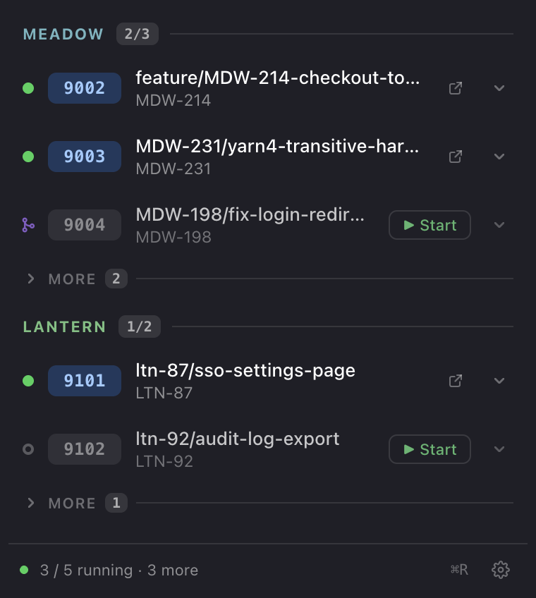
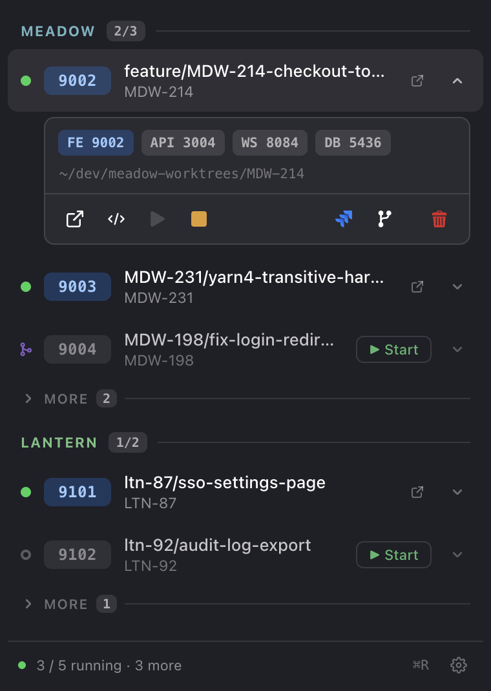
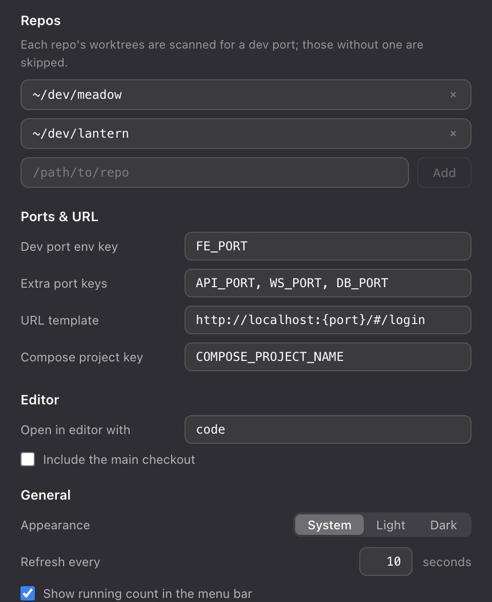

# Worktree Menubar

macOS menubar app that answers: **which branch is running on which localhost, is it up, and let me open the right one.**

For each git worktree it shows branch ↔ port ↔ running-state, with actions to open the dev URL, open the worktree in your editor, start/stop the Docker stack, and tear it down.

|                                                        |                                                            |
| ------------------------------------------------------ | ---------------------------------------------------------- |
|  |  |

## How it reads your machine

1. **Repos** — you list repo roots in `~/.config/worktree-menubar.json` (or via Settings).
2. **Worktrees** — each repo's `git worktree list` is scanned. The main checkout is skipped unless enabled.
3. **Ports** — each worktree's `.env` is read; the dev-port key (default `FE_PORT`) makes it a served row, extra keys (`API_PORT, WS_PORT, DB_PORT`) become chips in the expanded panel. Worktrees without a dev port are listed in a collapsed **more** section per repo — same editor/Jira/PR/destroy actions, plus **↑ Promote**.
4. **Status** — `docker compose ls` maps compose projects (via `COMPOSE_PROJECT_NAME` in `.env`, falling back to the directory name) to running state. While a start/stop command is in flight the row shows an optimistic pulsing `starting…`/`stopping…` (promote shows `promoting…`).
5. **Links** — with a `jiraBaseUrl` configured, branches containing a ticket key (`ABC-123`) get a Jira button in the expanded panel; if `gh` finds a PR for the branch (repo inferred from the worktree's origin remote), a PR button appears next to it.

Everything refreshes every ~10 s (configurable), on popover open, and on ⌘R (or the `⌘R` footer button — both show a brief _Refreshing…_ toast).

## Actions

- **Click a row** → expands it (worktree path, port chips, action strip). **⌘-click** a running row opens its dev URL directly.
- Each running row has an **open-in-browser** button (left of the chevron); stopped rows show **▶ Start** (`docker compose up -d`).
- **Expanded panel** → a strip of borderless icon actions: open in browser · editor · green **start** · amber **stop** (`docker compose stop`), then Jira / GitHub-PR links and a red **destroy** aligned right. Icons that don't currently apply (already running, no PR yet, no ticket key) stay in place but grayed out; hovering any icon for a beat shows its label. Branch names too long for the row are truncated; pausing on one shows the full name. Unserved rows get editor + `↑ Promote` instead of the stack actions.
- **↑ Promote** runs the configured `promoteCommand` ({branch}/{path} placeholders, cwd = the worktree) to give an unserved worktree ports/.env and boot it — e.g. a `cutover-work`-style script. Hidden until a command is configured.
- **Destroy** (full cleanup: `docker compose down -v --remove-orphans` → `git worktree remove --force` → prune, **keeps the branch**) requires typing `DESTROY`. Force is deliberate: real worktrees always carry untracked files (`.husky/_`, `.env`, `node_modules`) that make the non-force remove refuse, so typing `DESTROY` is the confirmation — uncommitted work in that worktree is gone. Tick **+ branch** next to the input (off by default) to also `git branch -D` the local branch. The row disappears as soon as the command finishes. Destroying an unserved worktree skips the docker step; if docker down fails the worktree is still removed and the toast names the compose project to clean up by hand. Volume cleanup only happens here — stop never touches data.
- **Merged indicator** — when the branch's PR is merged (per `gh pr view`), the row's status dot (or the dotted circle on unserved rows) becomes a purple merge glyph: done, safe to destroy. Hover it for the PR number and base branch. Open PRs are rechecked every ~3 min so a merge shows up soon after.
- Tray shows `running/total` (e.g. `3/5`); in the footer `⌘R` refreshes and the gear opens Settings (right-click the tray for Refresh / Settings / Quit).

## Config

`~/.config/worktree-menubar.json` — hand-editable, hot-reloaded on every refresh:

```json
{
  "repos": ["~/dev/meadow", "~/dev/lantern"],
  "devPortKey": "FE_PORT",
  "extraPortKeys": ["API_PORT", "WS_PORT", "DB_PORT"],
  "urlTemplate": "http://localhost:{port}/#/login",
  "composeProjectKey": "COMPOSE_PROJECT_NAME",
  "editorCommand": "code",
  "jiraBaseUrl": "https://yourteam.atlassian.net",
  "promoteCommand": "cutover-work {branch} --local --no-open",
  "includeMainCheckout": false,
  "theme": "system",
  "refreshSeconds": 10,
  "showCountInMenuBar": true,
  "launchAtLogin": false
}
```

All of it is also editable in the Settings window:



## Install

Grab the latest zip from [Releases](https://github.com/carolineartz/worktree-menubar/releases):

```sh
# unzip, move Worktree Menubar.app to /Applications, then (unsigned app, one time):
xattr -cr "/Applications/Worktree Menubar.app"
```

Requires macOS (Apple Silicon) + Docker. On first launch, point `repos` at your repo roots (via Settings, or the config above).

## Development

Built on the [pr-menubar](https://github.com/carolineartz/pr-menubar) Electron scaffold — Tray + frameless vibrancy `BrowserWindow`, electron-vite, React, TypeScript — and its shared visual language (`design/STYLE-GUIDE.md`).

```bash
pnpm install
pnpm dev          # against your real worktrees/docker
pnpm dev:mock     # the design bundle's fictional demo dataset (meadow/lantern)
pnpm test         # vitest: env/compose parsing, porcelain parsing, presenters
pnpm typecheck && pnpm lint
pnpm build:mac    # .app in dist/ (unsigned, dir target)
```

`WTMB_SHOOT=1 WTMB_MOCK=1 pnpm start` regenerates `docs/screenshots/` from the mock dataset. `WTMB_SCENARIO=empty|no-config|docker-off` forces the corresponding state in mock mode.

The hi-fi design handoff this implements — interactive prototype, style guide, reference screenshots — lives in [`design/`](design/).
